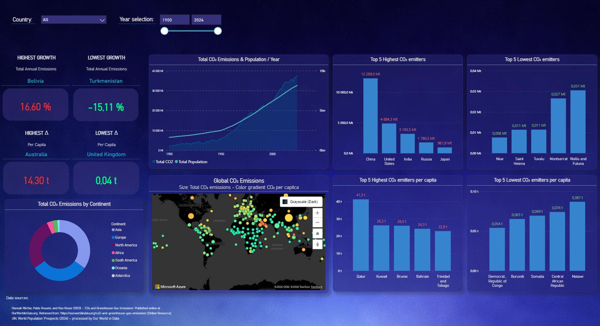

# Global CO2 Emissions Dashboard

An interactive Power BI dashboard analyzing global carbon dioxide emissions from 1900 to 2024, exploring patterns across countries, continents, and time.

> **Work in progress** — This dashboard is actively being developed with new features and refinements ongoing.

---

## Overview

This dashboard answers key questions about global CO2 emissions:

- **Who emits the most?** Top emitters by total volume and per capita intensity
- **How has it changed over time?** 124 years of emissions data alongside population growth
- **Where are the biggest shifts?** Countries with the highest growth and steepest decline in emissions
- **Which regions dominate?** Continental breakdown revealing Asia's 63% share of current emissions

### Key Insights

| Insight | Finding |
|---|---|
| Top Emitter | China (12,289 Mt — 33% of global) |
| Highest Per Capita | Qatar (41.3 t/person) |
| Concentration | Top 5 countries = ~62% of global emissions |
| Regional Dominance | Asia alone represents ~63% of current emissions |
| Highest Growth (Total) | Bolivia (+16.60%) |
| Lowest Growth (Total) | Turkmenistan (-15.11%) |
| Highest Change Per Capita | Australia (+14.30 t) |
| Lowest Change Per Capita | United Kingdom (+0.04 t) |

### What the Data Reveals

**Volume and intensity tell very different stories.** The highest total emitters (China, US, India) are not the highest per capita emitters (Qatar, Kuwait, Brunei). China emits 33% of the world's CO2 but ranks far lower per person, while Qatar's per capita emissions are roughly 600x higher than the Democratic Republic of Congo's. This distinction — visible through the map's dual encoding of bubble size (total) and color (per capita) — is one of the dashboard's core analytical contributions.

**Extreme concentration at the top.** The top 5 emitting countries account for approximately 62% of all global CO2 emissions. The remaining 213 countries share the other 38%. This pattern of concentration is a key takeaway for anyone analyzing where climate policy could have the largest impact.

**Some countries have decoupled growth from emissions — most have not.** Sweden's time series shows emissions peaking around 1970 and declining steadily while population continued to grow — a clear decoupling. Globally, no such decoupling is visible yet: CO2 and population curves continue to rise together, with emissions accelerating sharply from around 1950.

**The most vulnerable emit the least.** The lowest total emitters — Niue (0.008 Mt), Saint Helena (0.011 Mt), Tuvalu (0.011 Mt) — are predominantly small island nations and remote territories, many of which face the most severe consequences of climate change through rising sea levels.

**Growth and reduction patterns don't follow simple regional logic.** Bolivia leads in emissions growth (+16.60%) while Turkmenistan shows the steepest decline (-15.11%). Australia saw the highest per capita increase (+14.30 t) while the United Kingdom's was nearly flat (+0.04 t) — two wealthy, comparable nations with vastly different trajectories.

---

## Features

### Visualizations

- **Top 5 Highest / Lowest CO2 Emitters (End Year)** — Bar charts showing the countries with the highest and lowest total CO2 emissions at the selected end year
- **Top 5 Highest / Lowest CO2 Emitters Per Capita (End Year)** — Bar charts comparing per capita emissions intensity across countries
- **Total CO2 Emissions & Population / Year** — Dual-axis line chart tracking CO2 emissions and world population from 1900-2024
- **Total CO2 Emissions by Continent** — Donut chart showing regional distribution across 7 continents
- **Global CO2 Emissions Map** — Azure Maps bubble chart where bubble size encodes total emissions and color gradient encodes CO2 per capita intensity. Tooltips display total CO2, CO2 per capita, and population (latest year) for each country
- **KPI Cards** — Dynamic cards displaying highest/lowest growth in total emissions (%) and largest/smallest change in per capita emissions (t) across the selected year range

### Interactivity

- **Year Range Slicer** (1900-2024) — Controls all visuals across the dashboard
- **Country Selection Filter** — Controls the bar charts, line chart, donut chart, and map; cross-filtering works in both directions
- **Dynamic KPIs** — KPI cards update to reflect the country and value with the highest/lowest change within the selected year range
- **Tooltips** — Hover for detailed per-country metrics including population and emission shares

---

## Technical Highlights

- **Star Schema** — Optimized data model with fact/dimension separation for performance and clarity
- **Measure Organization** — Centralized `_MEASURES` table with logical grouping (Core, Helpers, KPIs)
- **Dynamic Year Range Calculations** — Delta measures that respond to the year range slicer, comparing start year vs end year values
- **TOPN Ranking Logic** — DAX patterns using `ADDCOLUMNS` + `FILTER` + `TOPN` + `MAXX/MINX` to dynamically surface the top/bottom performing countries
- **Azure Maps Integration** — Bubble map with dual-dimensional encoding (size = total CO2, color gradient = CO2 per capita)
- **Null Handling** — NonZero wrapper measures to cleanly exclude missing or zero-emission entries from rankings and visuals

---

## Data Sources

- **CO2 Emissions:** Hannah Ritchie, Pablo Rosado, and Max Roser (2023) — *CO2 and Greenhouse Gas Emissions*. Published online at [OurWorldInData.org](https://ourworldindata.org/co2-and-greenhouse-gas-emissions)
- **Population:** UN World Population Prospects (2024) — processed by Our World in Data
- **Coverage:** 1900-2024 · 218 countries · 60+ emission-related metrics

---

## Getting Started

1. Download the `.pbix` file from this repository
2. Open in **Power BI Desktop** (November 2024 or later recommended)
3. Data is embedded — no external refresh needed

---

## Future Enhancements

- [ ] Drillthrough page for country-level deep dives
- [ ] Bookmark navigation for guided storytelling
- [ ] Integration with GDP data for emissions-to-GDP decoupling analysis
- [ ] Cumulative emissions view — historical responsibility vs current annual output
- [ ] Forecasting using Power BI's built-in analytics
- [ ] Dynamic titles that update based on slicer selections

---

## Author

**[Your Name]**

Looking for opportunities in data analytics. Background in SQL and Excel, currently expanding into Power BI and the broader Microsoft data stack.

- Microsoft Data Analytics Professional Certificate (Coursera)
- Microsoft Certified: Power BI Data Analyst Associate (PL-300) — planned

---

## License

This project is open source and available under the [MIT License](LICENSE).

---

*Built with Power BI Desktop | Data from [Our World in Data](https://ourworldindata.org)*
